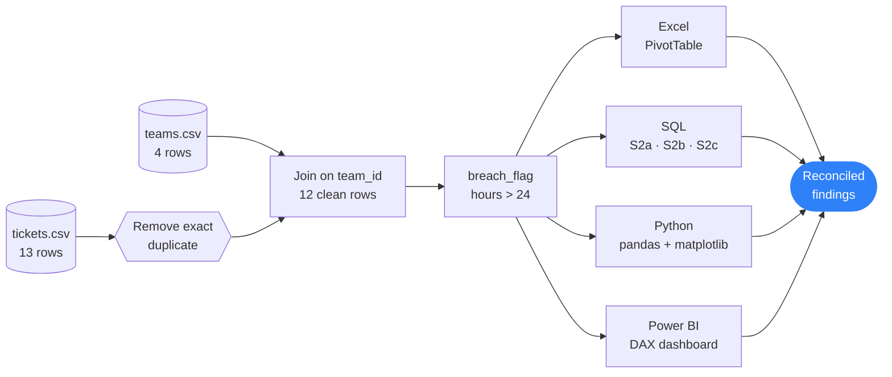
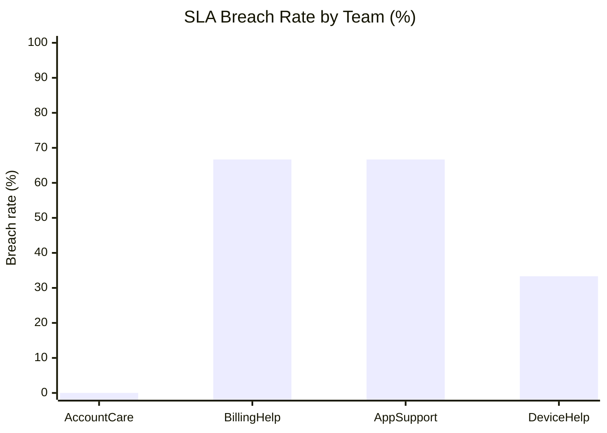
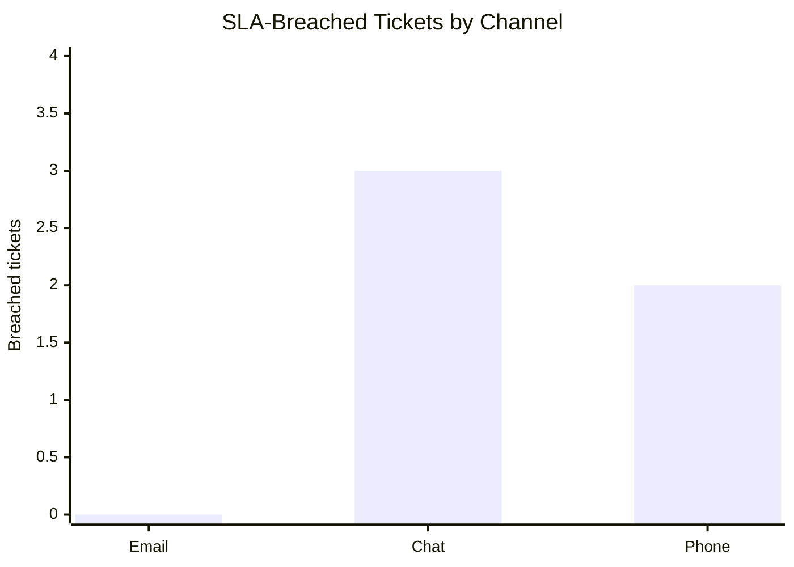

<div align="center">


<a href="https://git.io/typing-svg"></a>

<br/>


**Practical Exam — Data Analysis · Set A**

</div>

---


This project analyzes **12 unique customer-support tickets** to answer one business question:

> **Which support team should improve resolution performance, and how does service quality vary by channel?**

| Metric | Result |
|:--|:--|
| 🎯 Highest SLA-breach teams | **BillingHelp** and **AppSupport** — tied at **66.67%** (2 of 3 tickets each) |
| 📞 Channel with most breaches | **Chat** — 3 breached tickets (Phone: 2, Email: 0) |
| ⏱️ Slowest department | **Technical** — 28.33 hrs average vs. 19.33 hrs for Service |
| ✅ Cross-tool reconciliation | Excel, SQL, Python and Power BI all return **28.33 hrs** for Technical |

---




---


### Dataset

| File | Role | Rows |
|:--|:--|:-:|
| `data/raw/tickets.csv` | Fact table — support tickets | 13 (1 exact duplicate) → **12 clean** |
| `data/raw/teams.csv` | Lookup table — teams and departments | 4 |

| Team ID | Team | Department |
|:-:|:--|:--|
| T1 | AccountCare | Service |
| T2 | BillingHelp | Service |
| T3 | AppSupport | Technical |
| T4 | DeviceHelp | Technical |

### Cleaning Rules

- The exact duplicate `12,Mar,T4,Phone,24,5` is kept **once**.
- `team_id` is the join key between tickets and teams.
- Numeric fields stay numeric; months are ordered **Jan → Feb → Mar**.

### Metric Definitions

```text
breach_flag     = 1 if resolution_hours > 24, else 0     (exactly 24 hrs meets the SLA)
SLA Breach Rate = tickets with resolution_hours > 24 ÷ total tickets
```

---


### 1 · SLA Breach Rate by Team



| Team | Breached | Total | Breach Rate |
|:--|:-:|:-:|:-:|
| AccountCare | 0 | 3 | 0.00% |
| **BillingHelp** | **2** | 3 | **66.67%** |
| **AppSupport** | **2** | 3 | **66.67%** |
| DeviceHelp | 1 | 3 | 33.33% |

### 2 · Breached Tickets by Channel



### 3 · Department Performance

| Department | Tickets | Breached | Breach Rate | Avg Resolution (hrs) |
|:--|:-:|:-:|:-:|:-:|
| Service | 6 | 2 | 33.33% | 19.33 |
| Technical | 6 | 3 | 50.00% | **28.33** |

### 4 · Average Resolution Time by Month

```mermaid
xychart-beta
    title "Average Resolution Time (hours)"
    x-axis [Jan, Feb, Mar]
    y-axis "Hours" 20 --> 28
    line [24.00, 24.00, 23.50]
```

### 5 · Department × Month (Excel PivotTable)

| Department | Jan | Feb | Mar | Overall |
|:--|:-:|:-:|:-:|:-:|
| Service | 20.00 | 19.00 | 19.00 | 19.33 |
| Technical | 28.00 | 29.00 | 28.00 | 28.33 |
| **Overall** | 24.00 | 24.00 | 23.50 | 23.83 |

### 6 · Teams With Average Resolution Above 24 Hours (SQL S2b)

| Team | Avg Resolution (hrs) |
|:--|:-:|
| AppSupport | 28.67 |
| DeviceHelp | 28.00 |
| BillingHelp | 26.67 |

> 💡 **Insight:** DeviceHelp's average exceeds 24 hrs, yet only 1 of its 3 tickets breached the SLA. Average time and breach rate measure different things, so the breach rate is used as the primary prioritization metric.

---


1. **Prioritize BillingHelp and AppSupport** for a resolution-performance review — each has the highest observed breach rate (66.67%).
2. **Include Chat cases in the review** — Chat accounts for the most SLA-breached tickets (3).

**Limitation:** the dataset is a small synthetic sample of 12 tickets. Findings describe this practical's data and should not be generalized to a production support operation without more data.

---


**Aggregate checked:** average resolution time for the **Technical** department (underlying value ≈ 28.3333 hrs, reported to two decimals).

| Tool | Method | Result |
|:--|:--|:-:|
| Excel | PivotTable | ✅ 28.33 hrs |
| SQL | Query S2a | ✅ 28.33 hrs |
| Python | pandas on clean data | ✅ 28.33 hrs |
| Power BI | Technical filter | ✅ 28.33 hrs |

**Data integrity:** the SQL diagnostic returned an empty result set — zero unmatched `team_id` values between tickets and teams.

---


<details>
<summary><b>📗 Excel</b> — <code>excel/analysis.xlsx</code></summary>
<br/>

Sheets: **Raw** (13 rows) · **Lookup** (4 rows) · **Clean** (12 rows with department and `breach_flag`) · **Summary** (channel counts, PivotTable, chart).
Formulas and the PivotTable remain fully editable.

</details>

<details>
<summary><b>🗄️ SQL</b> — <code>sql/setup.sql</code> · <code>sql/queries.sql</code></summary>
<br/>

Run `setup.sql` first, then `queries.sql`.

| Query | Purpose |
|:--|:--|
| **S2a** | Average resolution time by department |
| **S2b** | Teams whose average resolution exceeds 24 hrs |
| **S2c** | Top two channels by breach count (alphabetical tie-break) |
| **S3** | Data-integrity check for unmatched team IDs |

</details>

<details>
<summary><b>🐍 Python</b> — <code>python/analysis.py</code></summary>
<br/>

Loads both CSVs with repository-relative paths, removes the duplicate, merges on `team_id`, asserts 12 rows and no missing departments, builds `breach_flag`, summarizes breach rates, and exports the chart and CSV outputs.

</details>

<details>
<summary><b>📊 Power BI</b> — <code>powerbi/dashboard.pbix</code></summary>
<br/>

**Model:** one-to-many `teams[team_id] → tickets[team_id]`, single-direction filtering.

```dax
Ticket Count     = COUNTROWS(tickets)
Avg Satisfaction = AVERAGE(tickets[satisfaction])
SLA Breach Rate  =
DIVIDE(
    COUNTROWS( FILTER( tickets, tickets[resolution_hours] > 24 ) ),
    COUNTROWS( tickets ),
    0
)
```

**Report page:** three KPI cards, department comparison, monthly trend, and a channel slicer that filters every visual.
If the source path is reported missing, point the CSV sources to the local `data/raw/` folder and refresh.

</details>

---


```text
data-analysis-set-b-<student-id>/
├── README.md
├── requirements.txt
├── data/raw/
│   ├── tickets.csv
│   └── teams.csv
├── excel/analysis.xlsx
├── sql/
│   ├── setup.sql
│   └── queries.sql
├── python/analysis.py
├── powerbi/dashboard.pbix
└── outputs/
    ├── clean_data.csv
    ├── python_summary.csv
    ├── python_chart.png
    ├── powerbi_dashboard.png
    └── sql/
        ├── s2a_avg_resolution_by_department.csv
        ├── s2b_teams_breaching_sla.csv
        ├── s2c_top_two_channels_by_breach_count.csv
        └── s3_data_integrity_check.csv
```

**Run the Python analysis** from the repository root:

```bash
pip install -r requirements.txt
python python/analysis.py
```

---


| Item | Value |
|:--|:--|
| Repository | `<PASTE GITHUB REPOSITORY URL>` |
| Video (5–10 min) | `<PASTE VIDEO URL>` · Duration: `<MM:SS>` |
| Final commit hash | `<PASTE COMMIT HASH>` |
| Excel · Power BI | `<VERSION>` · `<VERSION>` |
| SQL engine | `<ENGINE AND VERSION>` |
| Python · pandas · matplotlib | `<VERSION>` · `<VERSION>` · `<VERSION>` |

No external datasets or references were used.

---

<div align="center">


**Author:** Roshan Marathe  
**Student ID:** `<YOUR-STUDENT-ID>` · **Assigned Set:** B

*All work in this repository is my own except where cited.*

</div>
