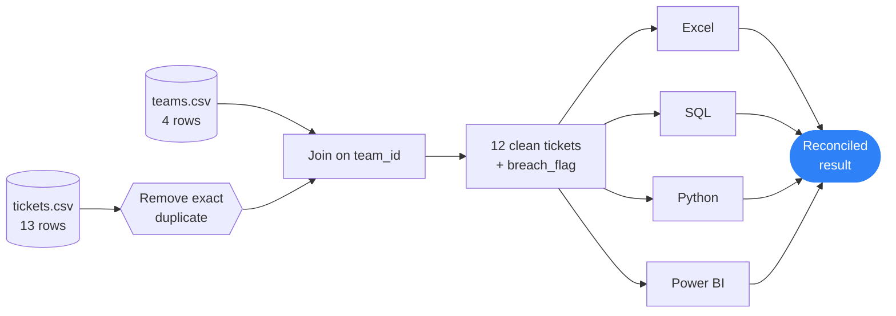
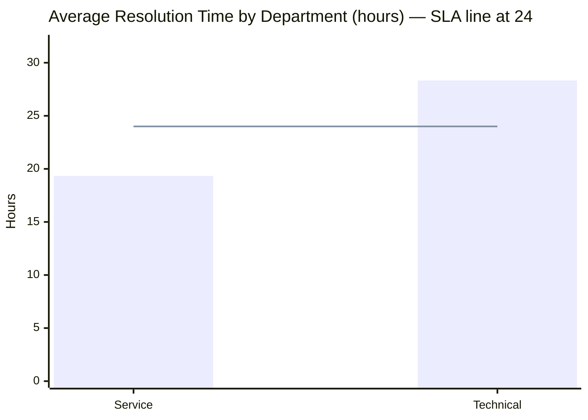
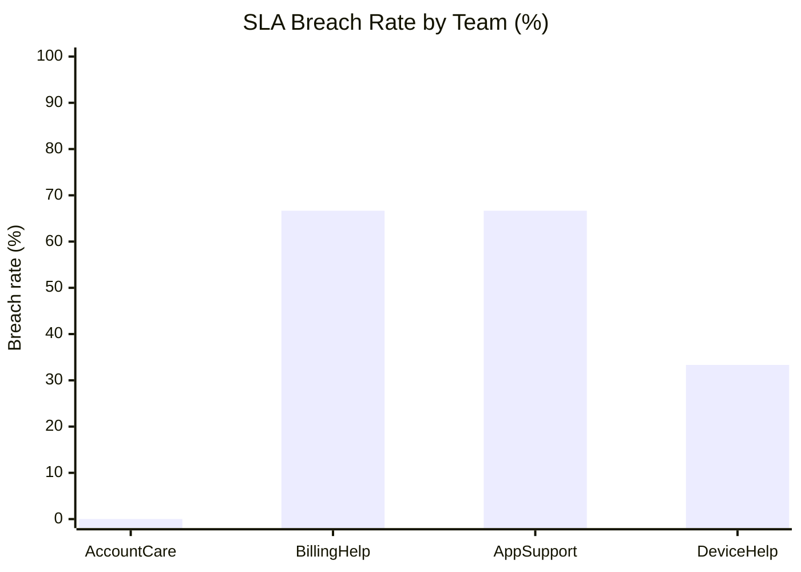
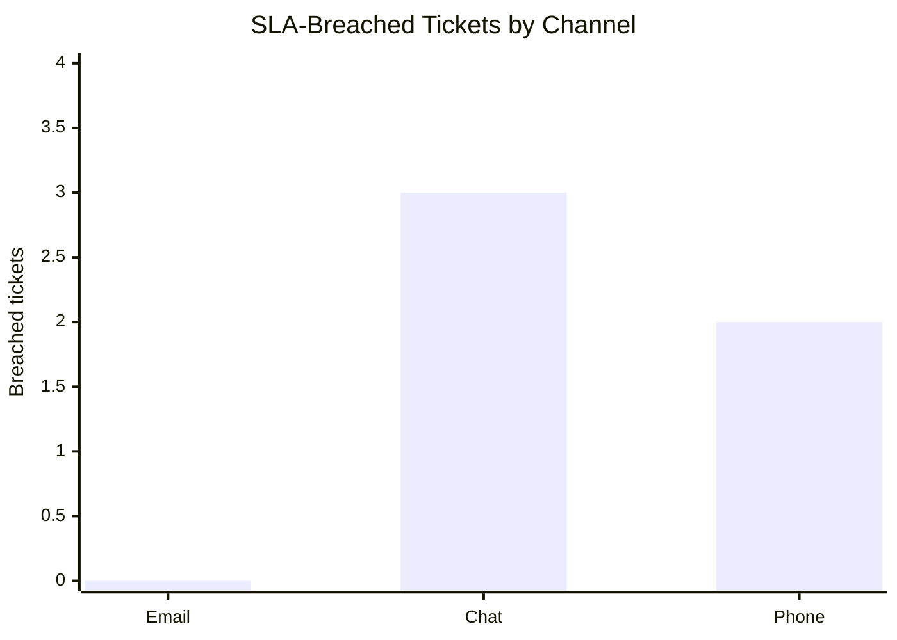

<div align="center">


<a href="https://git.io/typing-svg"></a>

<br/>


**Data Analysis Practical Exam — Set A**

</div>

---


This project analyzes **12 unique customer-support tickets** to answer one business question:

> **Which support team should improve resolution performance, and how does service quality vary by channel?**

The same cleaned data flows through Excel, SQL, Python and Power BI, and the key result is reconciled across all four tools.

| | Finding | Result |
|:-:|:--|:--|
| 🎯 | Highest SLA-breach teams | **BillingHelp** and **AppSupport** — **66.67%** each (2 of 3 tickets) |
| 📞 | Channel with most breaches | **Chat** — 3 breaches (Phone 2, Email 0) |
| ⏱️ | Slowest department | **Technical** — 28.33 hrs vs. 19.33 hrs for Service |
| ✅ | Cross-tool check | Technical average = **28.33 hrs** in all four tools |

> **SLA rule:** a ticket breaches the SLA only when `resolution_hours > 24`. Exactly 24 hours is compliant.

---




| Check | Result |
|:--|:-:|
| Source ticket rows | 13 |
| Exact duplicate removed (`12,Mar,T4,Phone,24,5`) | 1 |
| **Clean ticket rows** | **12** |
| Unmatched team IDs after join | **0** |
| Missing departments after join | **0** |

| Team ID | Team | Department |
|:-:|:--|:--|
| T1 | AccountCare | Service |
| T2 | BillingHelp | Service |
| T3 | AppSupport | Technical |
| T4 | DeviceHelp | Technical |

---








---


**File:** `excel/analysis.xlsx`

| Sheet | Purpose |
|:--|:--|
| `Raw` | Original 13-row ticket extract, unchanged |
| `Lookup` | 4-row team and department reference |
| `Clean` | 12 deduplicated rows with department and `breach_flag` |
| `Summary` | Channel breach counts, department × month PivotTable, chart |

**Key formulas**

```excel
=XLOOKUP([@team_id], Lookup[team_id], Lookup[department], "Not found")
=IF([@resolution_hours]>24, 1, 0)
=COUNTIFS(Clean[channel], A2, Clean[breach_flag], 1)
```

**Channel breaches**

| Channel | Breached Tickets |
|:--|:-:|
| Email | 0 |
| Chat | **3** |
| Phone | **2** |

**PivotTable — average resolution hours**

| Department | Jan | Feb | Mar | Overall |
|:--|:-:|:-:|:-:|:-:|
| Service | 20.00 | 19.00 | 19.00 | 19.33 |
| Technical | 28.00 | 29.00 | 28.00 | **28.33** |
| **Overall** | 24.00 | 24.00 | 23.50 | 23.83 |

> 💡 Technical stays above 24 hours in every month, which points to a department-specific issue rather than a time trend.

---


**Files:** `sql/setup.sql` → `sql/queries.sql` (run in this order)

**S2a — Average resolution time by department**

```sql
SELECT tm.department,
       ROUND(AVG(t.resolution_hours), 2) AS avg_resolution_hours
FROM tickets AS t
JOIN teams   AS tm ON t.team_id = tm.team_id
GROUP BY tm.department
ORDER BY avg_resolution_hours DESC;
```

| Department | Avg Resolution Hours |
|:--|:-:|
| Technical | **28.33** |
| Service | **19.33** |

**S2b — Teams averaging more than 24 hours**

```sql
SELECT tm.team,
       ROUND(AVG(t.resolution_hours), 2) AS avg_resolution_hours
FROM tickets AS t
JOIN teams   AS tm ON t.team_id = tm.team_id
GROUP BY tm.team
HAVING AVG(t.resolution_hours) > 24
ORDER BY avg_resolution_hours DESC;
```

| Team | Avg Resolution Hours |
|:--|:-:|
| AppSupport | 28.67 |
| DeviceHelp | 28.00 |
| BillingHelp | 26.67 |

**S2c — Top two channels by breach count** *(alphabetical tie-break)*

```sql
SELECT channel, COUNT(*) AS breach_count
FROM tickets
WHERE resolution_hours > 24
GROUP BY channel
ORDER BY breach_count DESC, channel
LIMIT 2;
```

| Channel | Breach Count |
|:--|:-:|
| Chat | **3** |
| Phone | **2** |

**S3 — Data integrity check:** the check for unmatched team IDs returned an **empty result** — every ticket maps to a valid team.

---


**File:** `python/analysis.py` — built with `pandas` and `matplotlib`, using repository-relative paths.

```python
from pathlib import Path
import pandas as pd

ROOT = Path(__file__).resolve().parents[1]
tickets = pd.read_csv(ROOT / "data" / "raw" / "tickets.csv").drop_duplicates()
teams   = pd.read_csv(ROOT / "data" / "raw" / "teams.csv")

df = tickets.merge(teams, on="team_id", how="left", validate="many_to_one")

assert len(df) == 12, "Clean dataset must contain 12 rows"
assert df["department"].notna().all(), "Every ticket must map to a department"

df["breach_flag"] = (df["resolution_hours"] > 24).astype(int)
```

**Department summary**

| Department | Tickets | Breached | Breach Rate |
|:--|:-:|:-:|:-:|
| Service | 6 | 2 | 33.33% |
| Technical | 6 | 3 | 50.00% |

**Team summary**

| Team | Breached | Total | Breach Rate |
|:--|:-:|:-:|:-:|
| AccountCare | 0 | 3 | 0.00% |
| **BillingHelp** | **2** | 3 | **66.67%** |
| **AppSupport** | **2** | 3 | **66.67%** |
| DeviceHelp | 1 | 3 | 33.33% |

**Monthly average resolution time**

<div align="center">


</div>

| Jan | Feb | Mar |
|:-:|:-:|:-:|
| 24.00 hrs | 24.00 hrs | 23.50 hrs |

---


**File:** `powerbi/dashboard.pbix`

<div align="center">

<!-- Save your dashboard screenshot as outputs/powerbi_dashboard.png -->


<sub>Interactive dashboard — the channel slicer filters every KPI card and chart.</sub>

</div>

**Data model:** active one-to-many relationship `teams[team_id] → tickets[team_id]`, single-direction filtering.

**DAX measures**

```dax
Ticket Count     = COUNTROWS(tickets)

Avg Satisfaction = AVERAGE(tickets[satisfaction])

SLA Breach Rate  =
DIVIDE(
    COUNTROWS( FILTER( tickets, tickets[resolution_hours] > 24 ) ),
    COUNTROWS( tickets ),
    0
)
```

**Report page**

| Visual | Purpose |
|:--|:--|
| KPI card — Ticket Count | Clean tickets in scope |
| KPI card — Avg Satisfaction | Average customer score (1–5) |
| KPI card — SLA Breach Rate | Share of tickets over 24 hrs |
| Department comparison | Resolution time by department |
| Monthly trend | Resolution time Jan → Mar |
| Channel slicer | Filters all cards and charts |

---


**Aggregate checked:** average resolution time for the **Technical** department.

| Tool | Method | Result |
|:--|:--|:-:|
| Excel | PivotTable | ✅ 28.33 hrs |
| SQL | Query S2a | ✅ 28.33 hrs |
| Python | `groupby("department")` mean | ✅ 28.33 hrs |
| Power BI | Technical filter | ✅ 28.33 hrs |

The underlying value is ≈ 28.3333 hrs; any difference is display rounding only.

---


### Recommendation

1. **Review BillingHelp and AppSupport first** — both have the highest observed breach rate (66.67%).
2. **Include Chat cases in the review** — Chat produces 3 of the 5 observed breaches.
3. **Focus on Technical** — its average resolution time is 9.00 hrs higher than Service, and it breaches the SLA on half of its tickets.

### Limitation

The dataset is synthetic and contains only 12 clean records. Each team has just 3 tickets, so a single extra ticket would shift its rate sharply. Treat these findings as a signal to investigate, not a verdict on a real support operation.

---


```text
data-analysis-set-e-<student-id>/
├── README.md
├── requirements.txt
├── data/raw/
│   ├── tickets.csv
│   └── teams.csv
├── excel/analysis.xlsx
├── sql/
│   ├── setup.sql
│   └── queries.sql
├── python/analysis.py
├── powerbi/dashboard.pbix
└── outputs/
    ├── clean_data.csv
    ├── python_summary.csv
    ├── python_chart.png
    ├── powerbi_dashboard.png
    └── sql/
        ├── s2a_avg_resolution_by_department.csv
        ├── s2b_teams_breaching_sla.csv
        ├── s2c_top_two_channels_by_breach_count.csv
        └── s3_data_integrity_check.csv
```

**Run the analysis**

```bash
pip install -r requirements.txt
python python/analysis.py
```

**SQL:** run `sql/setup.sql`, then `sql/queries.sql`.
**Power BI:** open `powerbi/dashboard.pbix`; if a source path is missing, point the CSV sources to `data/raw/` and refresh.

---


## Video Projection
| Video (5–10 min) | https://drive.google.com/file/d/1NujxN5tamvFvj6tBT8aYMGVTMz2a5DhE/view?usp=sharing · Duration: `11 min` |
No external datasets or references were used.

---

<div align="center">


**Author:** Roshan Marathe · AI/ML Student
**Student ID:** `10258` · **Assigned Set:** A

*All work in this repository is my own except where cited.*

</div>
